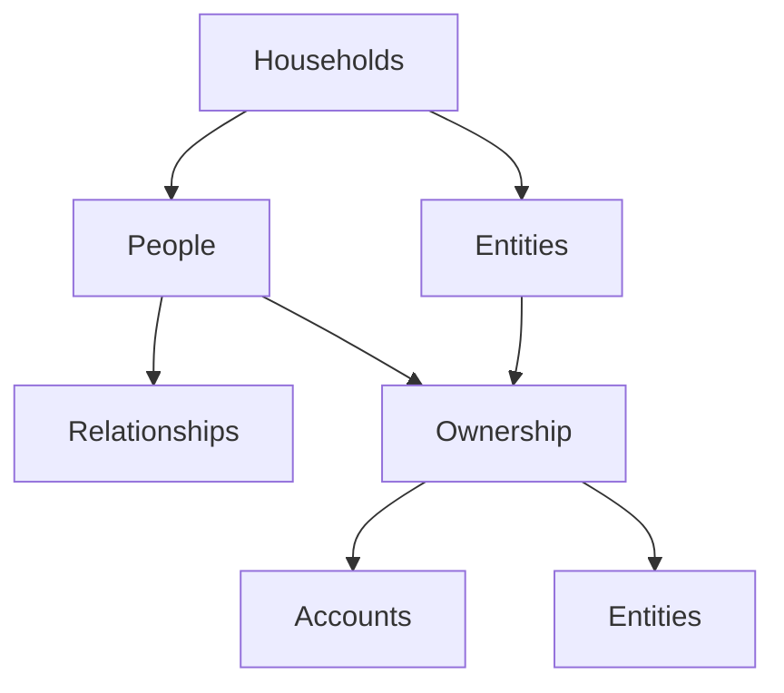
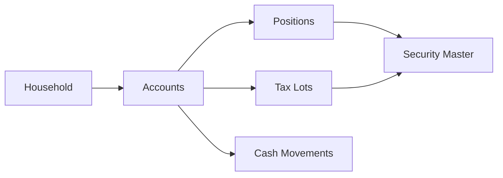
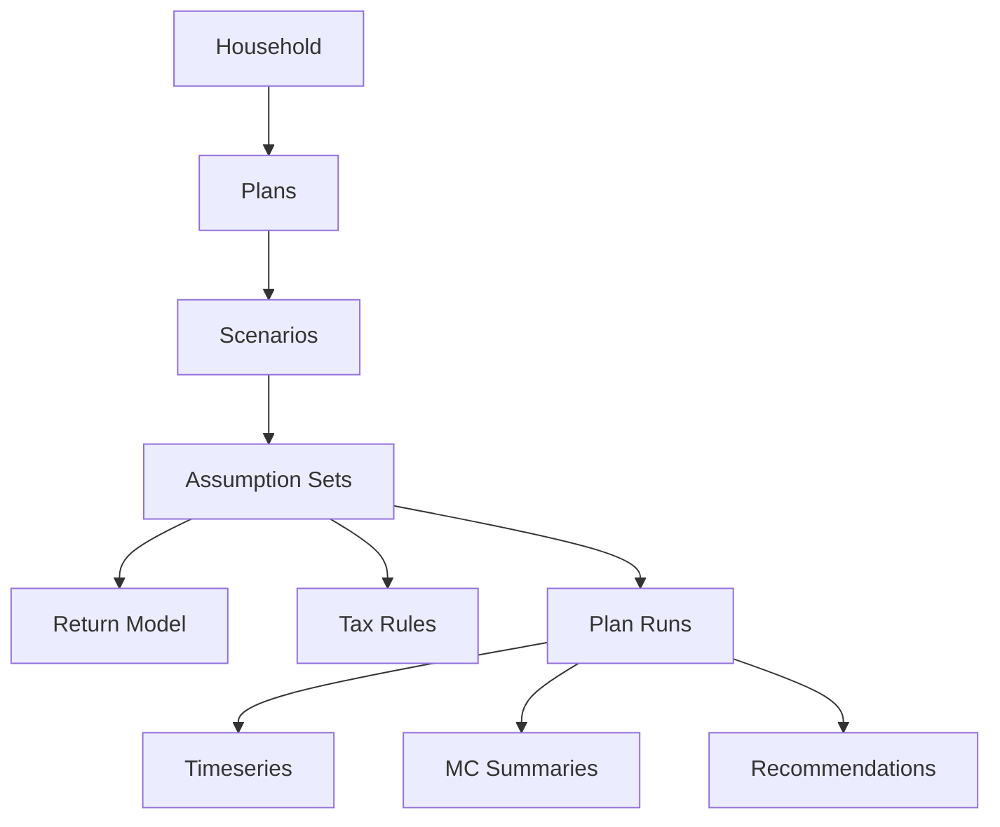
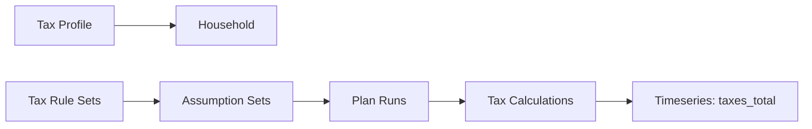

# Entity-Relationship Diagram (ERD)

## Farther Prism - Database Schema v1.0.0

---

## Full Schema Diagram (Mermaid)

```mermaid
erDiagram
    %% ========================================
    %% CORE IDENTITY GRAPH
    %% ========================================
    
    households ||--o{ people : contains
    households ||--o{ entities : owns
    households ||--o{ relationships : defines
    households ||--o{ ownership : tracks
    households ||--o{ accounts : holds
    households ||--o{ income_streams : receives
    households ||--o{ expense_streams : incurs
    households ||--o{ goals : pursues
    households ||--o{ constraints : enforces
    households ||--o{ policies : maintains
    households ||--o{ risk_profiles : assesses
    households ||--o{ tax_profiles : files
    households ||--o{ plans : creates
    households ||--o{ external_links : connects
    
    people ||--o{ relationships : participates_in
    people ||--o{ ownership : owns
    people ||--o{ income_streams : earns
    people ||--o{ policies : insured_by
    people ||--o{ risk_profiles : assessed
    
    entities ||--o{ ownership : owns
    
    %% ========================================
    %% ACCOUNTS & HOLDINGS
    %% ========================================
    
    accounts ||--o{ positions : holds
    accounts ||--o{ lots : tracks
    accounts ||--o{ cash_movements : records
    accounts }o--|| ownership : owned_by
    
    security_master ||--o{ positions : referenced_in
    security_master ||--o{ lots : referenced_in
    
    %% ========================================
    %% INCOME & EXPENSES
    %% ========================================
    
    expense_categories ||--o{ expense_streams : categorizes
    expense_categories ||--o{ expense_categories : parent_of
    
    %% ========================================
    %% GOALS & CONSTRAINTS
    %% ========================================
    
    goals ||--o{ goal_cashflow_rules : defines
    goals ||--o{ cash_movements : funds
    goals ||--o{ mc_distribution_summaries : evaluated_by
    
    %% ========================================
    %% TAX SYSTEM
    %% ========================================
    
    tax_rule_sets ||--o{ assumption_sets : used_in_federal
    tax_rule_sets ||--o{ assumption_sets : used_in_state
    
    %% ========================================
    %% PLANNING
    %% ========================================
    
    plans ||--o{ scenarios : contains
    
    scenarios ||--o{ assumption_sets : configures
    
    return_models ||--o{ assumption_sets : used_in
    
    assumption_sets ||--o{ plan_runs : executes
    
    %% ========================================
    %% PLAN OUTPUTS
    %% ========================================
    
    plan_runs ||--o{ projection_timeseries : produces
    plan_runs ||--o{ mc_distribution_summaries : summarizes
    plan_runs ||--o{ recommendations : generates
    plan_runs ||--o{ cash_movements : simulates
    
    %% ========================================
    %% TABLE DEFINITIONS
    %% ========================================
    
    households {
        uuid id PK
        varchar name
        uuid primary_advisor_id
        varchar service_tier
        varchar status
        timestamptz created_at
        timestamptz updated_at
    }
    
    people {
        uuid id PK
        uuid household_id FK
        varchar first_name
        varchar last_name
        date dob
        varchar ssn_last4
        varchar state_residence
        boolean is_primary
        varchar status
    }
    
    entities {
        uuid id PK
        uuid household_id FK
        varchar entity_name
        entity_type entity_type
        varchar tax_id_last4
        varchar state_of_formation
    }
    
    relationships {
        uuid id PK
        uuid household_id FK
        uuid person_id FK
        uuid related_person_id FK
        relationship_type relationship_type
        boolean dependent
    }
    
    ownership {
        uuid id PK
        uuid household_id FK
        uuid owner_person_id FK
        uuid owner_entity_id FK
        uuid owned_account_id FK
        uuid owned_entity_id FK
        numeric ownership_percentage
    }
    
    accounts {
        uuid id PK
        uuid household_id FK
        account_type account_type
        varchar account_name
        varchar custodian
        varchar tax_treatment
        varchar status
    }
    
    security_master {
        uuid id PK
        varchar symbol
        varchar name
        varchar security_type
        varchar asset_class
    }
    
    positions {
        uuid id PK
        uuid account_id FK
        uuid security_id FK
        numeric quantity
        numeric price
        numeric market_value
        date as_of_date
    }
    
    lots {
        uuid id PK
        uuid account_id FK
        uuid security_id FK
        date acquire_date
        numeric quantity
        numeric cost_basis_total
        varchar term
    }
    
    cash_movements {
        uuid id PK
        uuid account_id FK
        date movement_date
        varchar movement_type
        numeric amount
        tax_character tax_character
    }
    
    income_streams {
        uuid id PK
        uuid household_id FK
        uuid person_id FK
        income_type income_type
        varchar description
        numeric base_amount
        varchar amount_frequency
        numeric growth_rate
        date start_date
        date end_date
    }
    
    expense_categories {
        uuid id PK
        varchar category_name
        uuid parent_category_id FK
        boolean is_discretionary
    }
    
    expense_streams {
        uuid id PK
        uuid household_id FK
        uuid expense_category_id FK
        varchar description
        numeric base_amount
        varchar amount_frequency
        numeric inflation_rate
        date start_date
        date end_date
    }
    
    goals {
        uuid id PK
        uuid household_id FK
        goal_type goal_type
        varchar goal_name
        integer priority
        numeric target_amount
        date target_date
    }
    
    goal_cashflow_rules {
        uuid id PK
        uuid goal_id FK
        varchar flow_type
        varchar date_rule_type
        jsonb date_rule_params
        varchar amount_rule_type
        jsonb amount_rule_params
    }
    
    constraints {
        uuid id PK
        uuid household_id FK
        constraint_type constraint_type
        numeric value
        date effective_start
        date effective_end
    }
    
    policies {
        uuid id PK
        uuid household_id FK
        uuid insured_person_id FK
        varchar policy_type
        varchar carrier
        numeric coverage_amount
        numeric premium_annual
    }
    
    risk_profiles {
        uuid id PK
        uuid household_id FK
        uuid person_id FK
        integer risk_tolerance_score
        integer risk_capacity_score
        date effective_date
    }
    
    tax_profiles {
        uuid id PK
        uuid household_id FK
        filing_status filing_status
        uuid primary_filer_person_id FK
        varchar primary_state
        integer tax_year
    }
    
    tax_rule_sets {
        uuid id PK
        varchar jurisdiction
        integer tax_year
        jsonb rules_json
        varchar version
    }
    
    plans {
        uuid id PK
        uuid household_id FK
        varchar plan_name
        varchar status
    }
    
    scenarios {
        uuid id PK
        uuid plan_id FK
        varchar scenario_name
        varchar status
    }
    
    return_models {
        uuid id PK
        varchar model_name
        jsonb expected_returns
        jsonb covariance_matrix
        varchar version
    }
    
    assumption_sets {
        uuid id PK
        uuid scenario_id FK
        date valuation_as_of_date
        numeric inflation_cpi
        numeric healthcare_inflation
        uuid return_model_id FK
        uuid tax_rule_set_federal_id FK
        uuid tax_rule_set_state_id FK
        varchar version_hash
    }
    
    plan_runs {
        uuid id PK
        uuid scenario_id FK
        uuid assumption_set_id FK
        run_type run_type
        run_status run_status
        integer horizon_years
        integer num_simulations
        numeric success_probability
        timestamptz queued_at
        timestamptz completed_at
    }
    
    projection_timeseries {
        uuid id PK
        uuid plan_run_id FK
        varchar dimension
        varchar time_period
        integer time_index
        numeric value
        integer percentile
    }
    
    mc_distribution_summaries {
        uuid id PK
        uuid plan_run_id FK
        uuid goal_id FK
        numeric goal_success_probability
        numeric terminal_wealth_p50
        numeric terminal_wealth_p90
    }
    
    recommendations {
        uuid id PK
        uuid plan_run_id FK
        recommendation_category category
        varchar title
        text description
        jsonb impact_estimate
        numeric confidence_score
        integer priority
        varchar approval_status
    }
    
    external_links {
        uuid id PK
        uuid household_id FK
        varchar system_name
        varchar external_id
        varchar link_type
    }
    
    audit_log {
        uuid id PK
        uuid user_id
        varchar action
        varchar entity_type
        uuid entity_id
        jsonb old_values
        jsonb new_values
        timestamptz timestamp
    }
```

---

## Simplified Diagrams

### Core Identity Graph

### Account Holdings Flow

### Planning Hierarchy

### Tax System Flow

---

## Table Groups

### Identity (7 tables)
- `households`
- `people`
- `entities`
- `relationships`
- `ownership`
- `policies`
- `risk_profiles`

### Accounts (5 tables)
- `accounts`
- `security_master`
- `positions`
- `lots`
- `cash_movements`

### Cash Flow (3 tables)
- `income_streams`
- `expense_categories`
- `expense_streams`

### Goals (2 tables)
- `goals`
- `goal_cashflow_rules`
- `constraints`

### Tax (2 tables)
- `tax_profiles`
- `tax_rule_sets`

### Planning (4 tables)
- `plans`
- `scenarios`
- `return_models`
- `assumption_sets`

### Plan Outputs (4 tables)
- `plan_runs`
- `projection_timeseries`
- `mc_distribution_summaries`
- `recommendations`

### Integration (2 tables)
- `external_links`
- `audit_log`

---

## Cardinality Summary

| Relationship | Type |
|--------------|------|
| Household → People | 1:N |
| Household → Accounts | 1:N |
| Household → Plans | 1:N |
| Plan → Scenarios | 1:N |
| Scenario → Assumption Sets | 1:N |
| Assumption Set → Plan Runs | 1:N |
| Plan Run → Timeseries | 1:N |
| Plan Run → Recommendations | 1:N |
| Account → Positions | 1:N |
| Account → Lots | 1:N |
| Security → Positions | 1:N |
| Person → Relationships | N:M |
| Person → Ownership | N:M |

---

## Index Strategy Summary

- **Primary keys:** All tables (UUID)
- **Foreign keys:** All relationships
- **Timestamps:** `created_at`, `updated_at`, `as_of_date` (DESC)
- **Status filters:** Partial indexes (`WHERE status = 'active'`)
- **JSONB columns:** GIN indexes for JSON queries
- **Composite:** Common query patterns (`account_id, as_of_date DESC, security_id`)

---

## Notes

- All tables use UUID v4 for primary keys
- All mutable tables have `created_at` and `updated_at` timestamps
- Critical tables have audit triggers
- JSONB used for flexible structures (tax rules, return models, metadata)
- Enums used for controlled vocabularies (account_type, run_status, etc.)

---

**Generated:** February 23, 2026  
**Tool:** Mermaid (https://mermaid.js.org/)  
**View Online:** Paste into https://mermaid.live/
